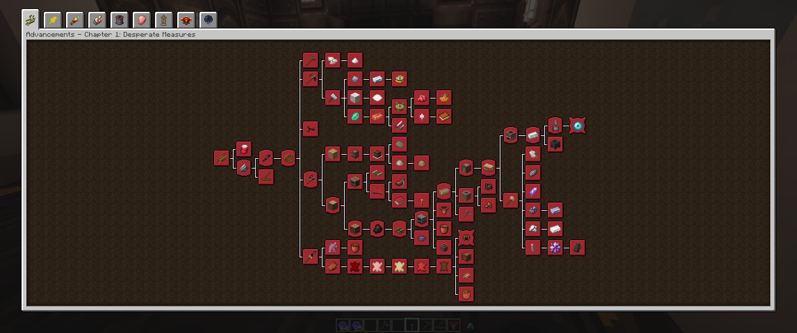

# Chapter 1: Desperate Measures

:::warning
This page is under construction. Check back soon because I am actively updating the wiki, I just wanted to get something online in case anyone can get use from what is up so far.
:::

After spawning in for the first time you will notice a few things that are different from vanilla or other modpacks you played before.

- Thirst
- Sanity
- Hearts Adjustment
- Temperature
- Journal Button in your inventory
- you're in a spawn structure, an underground bunker

When you walk outside and look up you will quickly notice pollution blocks in the sky
you will notice that there is no animals wandering around

Chapter 1 can be broken into a few milestones, you need to complete most to finish the chapter, but you will want to complete the optional milestones as they are very beneficial.

## The Preparation to Find Copper

## Making Leather

## Ceramics & Pottery

## Journey to a Lost City

## Metallurgy

## Spirit Orbs & The Goddess Statue

## The Hearth
