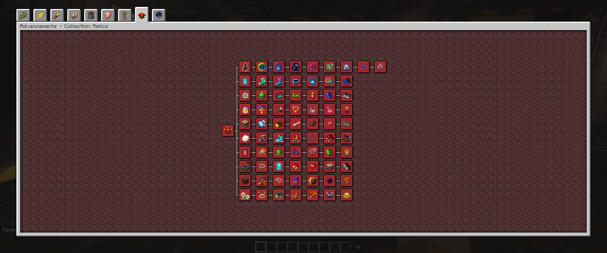

# Relics

There is a chance to get various relics when you complete gateways. Higher tier gateways give you higher chances to get them. You will combine all of the relics together to create an ultimate relic for use in the final creative recipes.

## Relevant Files

- mods - `relics` , `artifacts` ✔️
- relics config
  - `config/artifacts-client.toml` ✔️
  - `config/artifacts-common.toml` ✔️
- loot table modification - `kubejs/server_scripts/loot/chest.js` ✔️
- tags - `kubejs/server_scripts/tags/collections/relics.js` ✔️
- collection staging - `kubejs/server_scripts/stages/collections/relics.js` ✔️
- relics advancements - `kubejs/server_scripts/advancements/collections/relics.js` ✔️
- gateway drops - `???` ❓

:::warning
This page is under construction. Check back soon because I am actively updating the wiki, I just wanted to get something online in case anyone can get use from what is up so far.
:::
