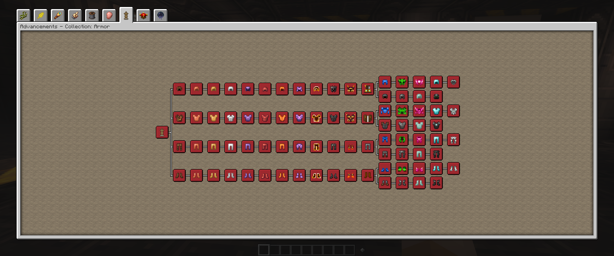

# Armor Progression

Armor is staged in this modpack. This means that to craft an armor tier (ex. Iron Armor) you need to craft the tiers before it at least once before. Crafting an armor tier unlocks a new recipe for it so that you can make the new tier directly without the previous tiers.

:::warning
This page is under construction. Check back soon because I am actively updating the wiki, I just wanted to get something online in case anyone can get use from what is up so far.
:::
