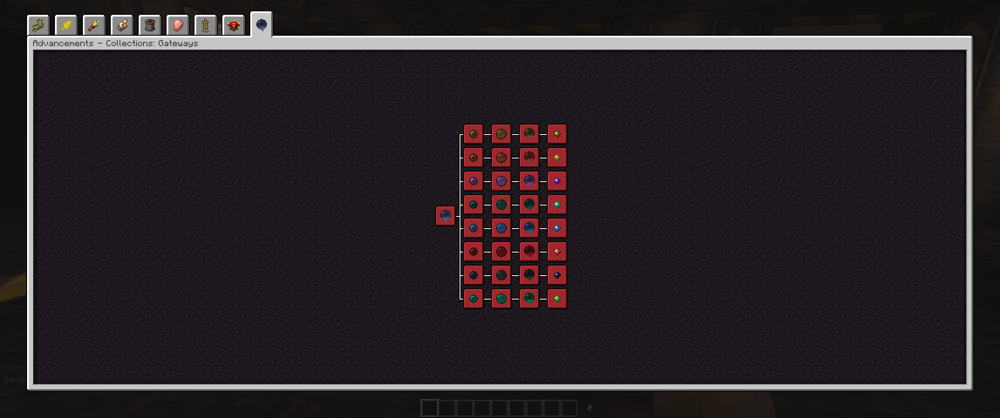

# Gateways

As you progress and visit new dimensions, you can use the drops of most of the enemies in that dimension to create gateways to that dimension in an occultism ritual. these gateways spawn waves of enemies, essentially fighting the whole dimension again. You get lots of mob drops as a result and if you finish the final wave, you bring some passive mobs back into the overworld and they will start spawning naturally. You can also have a chance to get relics which give you certain buffs. There are 3 tiers of each gateway. the first one is crafted and the other 2 are dropped from the final battle in the previous gateway. Higher tier gateways are harder and drop more and better stuff. The 3rd tier drops a token specific to that dimension, which will be used in the final recipes to complete the pack.

:::warning
This page is under construction. Check back soon because I am actively updating the wiki, I just wanted to get something online in case anyone can get use from what is up so far.
:::
